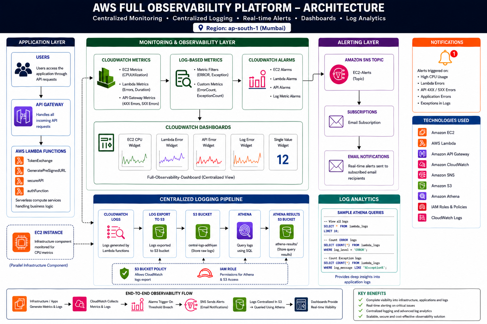

# AWS Full Observability Platform 🚀

A production-style AWS observability solution that provides **centralized monitoring, centralized logging, real-time alerting, dashboard visualization, and log analytics** for cloud workloads.

Built using AWS services to simulate a real-world observability architecture used by Cloud/DevOps engineers.

---

## Region

📍 **AWS Region:** `ap-south-1 (Mumbai)`

---

# Problem Statement

Modern cloud applications generate huge volumes of:

- Infrastructure metrics
- Application logs
- API failures
- Lambda exceptions
- Runtime events

Without centralized visibility:

❌ Teams struggle to identify failures quickly  
❌ Logs become scattered across services  
❌ Root-cause analysis becomes difficult  
❌ Alerting becomes delayed  
❌ Troubleshooting consumes engineering time  

Organizations require a centralized solution capable of:

- Monitoring infrastructure health
- Tracking application failures
- Centralizing logs
- Triggering real-time notifications
- Performing log analytics
- Visualizing everything from one dashboard

This project addresses these challenges by implementing an end-to-end AWS observability platform.

---

# Architecture Diagram



---

# Solution Architecture

This architecture combines:

### Monitoring Layer
- EC2 CPU monitoring
- Lambda monitoring
- API monitoring
- Log-based metrics

### Alerting Layer
- CloudWatch alarms
- SNS notifications
- Email subscriptions

### Logging Layer
- Centralized CloudWatch Logs
- S3 log export

### Analytics Layer
- Athena SQL queries
- Log analysis

### Dashboard Layer
- Full centralized dashboard

---

# Features

## Monitoring

✅ EC2 CPU monitoring  
✅ Lambda error tracking  
✅ API Gateway error tracking  
✅ Log-based custom metrics  
✅ Dashboard widgets  

---

## Real-Time Alerts

✅ CloudWatch alarms  
✅ SNS integration  
✅ Email notifications  
✅ End-to-end validation  

---

## Centralized Logging

✅ CloudWatch Logs  
✅ S3 export pipeline  
✅ Centralized log storage  

---

## Analytics

✅ Athena integration  
✅ SQL-based log querying  
✅ Error investigation  
✅ Exception analysis  

---

## Dashboard Visualization

Unified dashboard showing:

- EC2 Metrics
- Lambda Metrics
- API Metrics
- Error Metrics
- Single Value Widget
- Live visibility

---

# Services Used

| Service | Purpose |
|---|---|
| Amazon EC2 | Infrastructure metrics |
| AWS Lambda | Serverless applications |
| API Gateway | API metrics |
| Amazon CloudWatch | Monitoring & dashboards |
| Amazon SNS | Alert delivery |
| Amazon S3 | Centralized log storage |
| Amazon Athena | Log analytics |
| IAM | Access control |
| CloudWatch Logs | Log collection |

---

# Project Workflow

```text
Users
   ↓
API Gateway
   ↓
Lambda Functions
   ↓
CloudWatch Metrics
   ↓
Metric Filters
   ↓
CloudWatch Alarms
   ↓
SNS Topic
   ↓
Email Notifications


Logs
   ↓
CloudWatch Logs
   ↓
S3 Export
   ↓
Athena Queries
```

---

# Lambda Functions Used

- TokenExchange
- GeneratePreSignedURL
- secureAPI
- authFunction

---

# Dashboard Widgets

📊 EC2 CPU Widget

📊 Lambda Error Widget

📊 API Error Widget

📊 Log Error Widget

📊 Single Value Widget

---

# End-to-End Validation

### EC2
- CPU spike generation
- Alarm validation

### Lambda
- Exception generation
- Error validation

### API Gateway
- Triggered API failures
- Verified 4XX / 5XX alarms

### Logging
- Exported logs to S3

### Athena

```sql
SELECT *
FROM lambda_logs
LIMIT 10;
```

```sql
SELECT COUNT(*)
FROM lambda_logs
WHERE log_level='ERROR';
```

```sql
SELECT COUNT(*)
FROM lambda_logs
WHERE log_message LIKE '%Exception%';
```

---

# Implementation Screenshots

## Monitoring Implementation

👉 **[Click Here](./monitoring)**

Contains:

- SNS setup
- Alarm creation
- CloudWatch Dashboard
- Metric filters
- Alert validation
- Monitoring screenshots

---

## Centralized Logging Implementation

👉 **[Click Here](./centralized-logging)**

Contains:

- CloudWatch Logs
- S3 export setup
- Athena setup
- SQL queries
- Logging validation screenshots

---

# Documentation

📘 Complete 15-page project documentation:

👉 **[Click Here to View Documentation](./documentation/AWS-Observability-Platform.pdf)**

Includes:

- Architecture explanation
- Complete setup
- Monitoring implementation
- Logging implementation
- Analytics workflow
- Validation
- Results

---

# Folder Structure

```text
AWS-Full-Observability-Platform/

├── architecture/
├── monitoring/
├── centralized-logging/
├── setup-guide/
├── documentation/
├── screenshots/
└── README.md
```

---

# Key Outcomes

✔ Centralized monitoring

✔ Real-time alerting

✔ Dashboard visibility

✔ Log centralization

✔ SQL-based analytics

✔ Production-style observability architecture

---

# Future Enhancements

- OpenSearch integration
- Grafana dashboards
- Slack alerting
- AWS X-Ray tracing
- Cross-account observability
- Multi-region monitoring

---

# Author

**Adhithyan Sivaraman T**

GitHub: https://github.com/Adhithyan-10

LinkedIn: www.linkedin.com/in/adhithyan-sivaraman-t-399b5b362

---

Built with AWS ☁️
