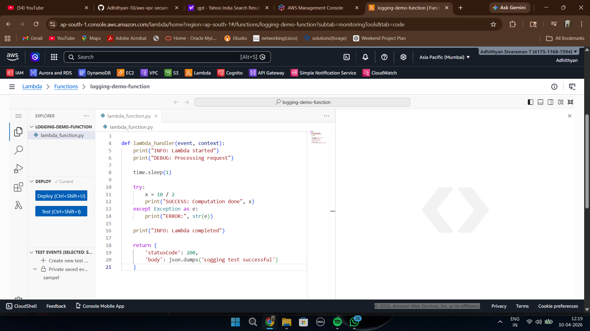
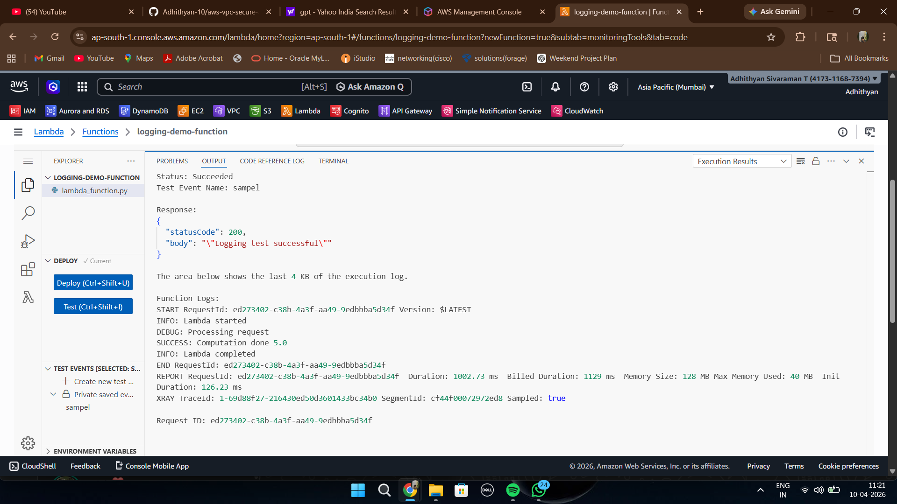
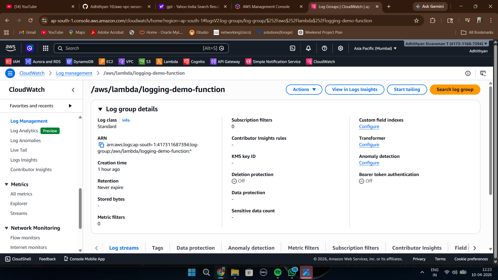
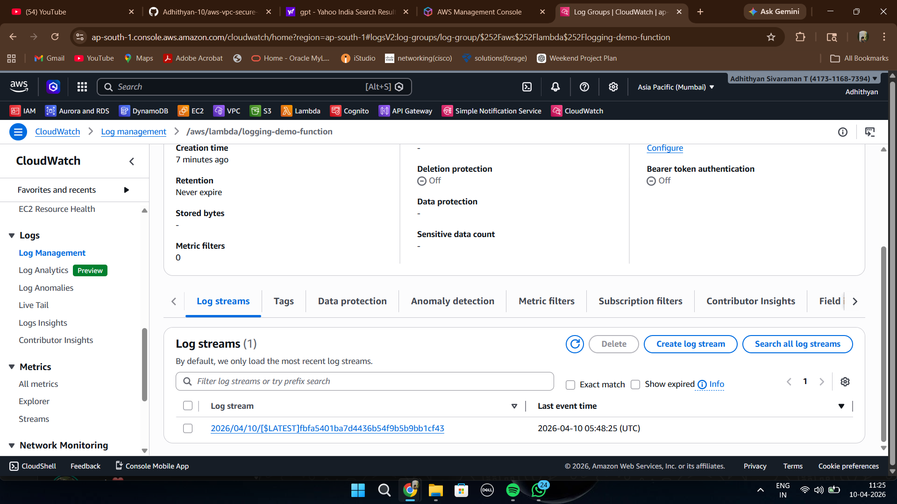
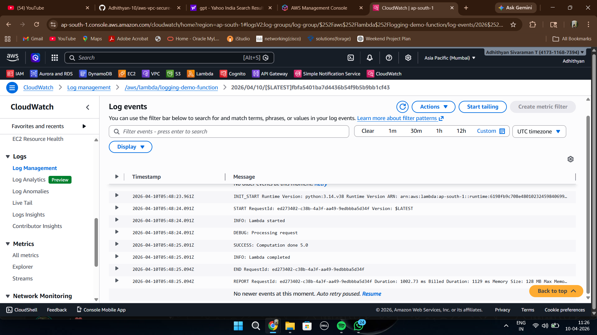
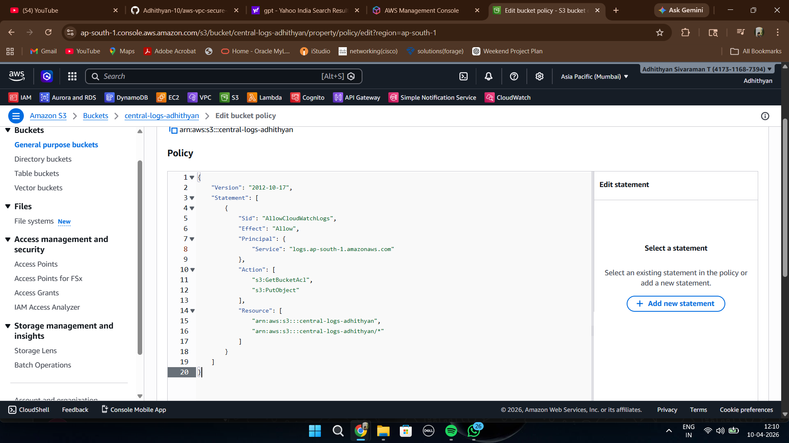
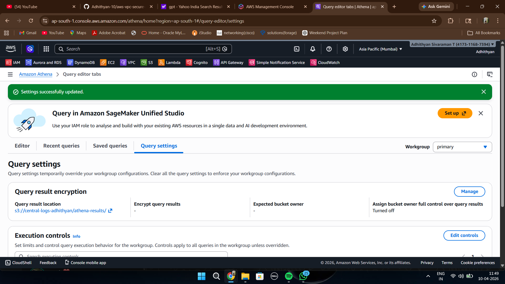
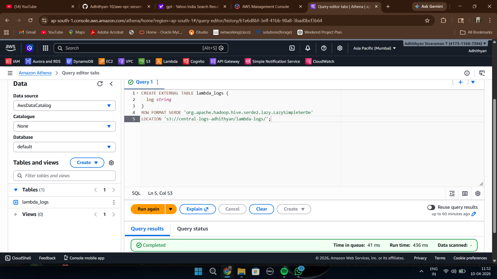
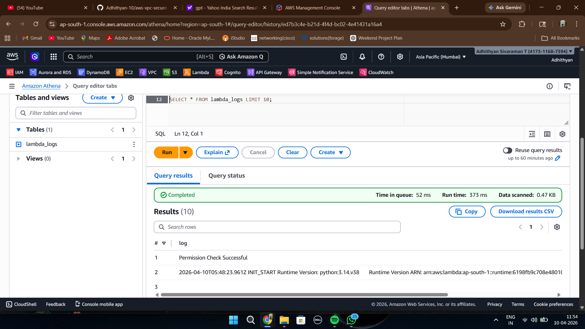
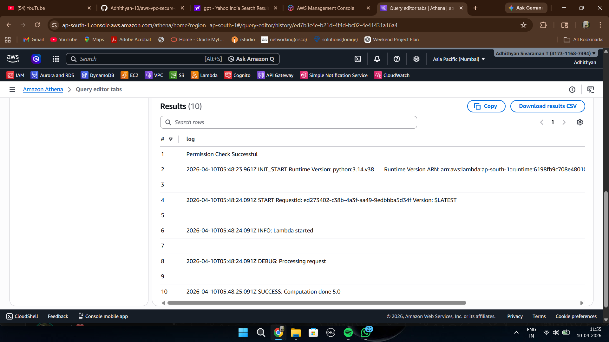

# Centralized Logging

## Overview

This module implements a centralized logging solution in AWS. Logs generated by an AWS Lambda function are captured by CloudWatch Logs, exported to Amazon S3, and queried using Amazon Athena. This creates a centralized location for storing, searching, and analyzing logs across applications.

---

## Architecture Flow

Lambda Function  
⬇  
CloudWatch Logs  
⬇  
S3 Central Log Storage  
⬇  
Amazon Athena Query Engine  
⬇  
Log Analytics

---

## AWS Services Used

- AWS Lambda
- Amazon CloudWatch Logs
- Amazon S3
- Amazon Athena
- IAM

---

## Implementation Steps

### Step 1: Create Lambda Function

A Lambda function was created to generate sample application logs such as INFO, DEBUG, and SUCCESS events.

The code prints multiple log messages and simulates an application workflow. These logs are automatically sent to CloudWatch during execution.

---

### Step 2: Execute Lambda Function

The Lambda function was executed using a test event to generate runtime logs.

Execution completed successfully and produced application logs that can later be analyzed through CloudWatch and Athena.

---

### Step 3: Verify CloudWatch Log Group

CloudWatch automatically created a log group for the Lambda function.

A log group acts as a container that stores logs generated from Lambda executions.

---

### Step 4: Inspect Log Stream

The generated execution created a log stream inside the CloudWatch log group.

Each Lambda execution creates log streams that organize events chronologically.

---

### Step 5: View Log Events

The log stream contains detailed events generated by the Lambda function.

The events contain INFO, DEBUG, SUCCESS and execution metadata useful for troubleshooting and monitoring.

---

### Step 6: Store Logs in Amazon S3

CloudWatch logs were exported to an S3 bucket to create centralized storage.

.png)

Amazon S3 serves as durable storage for collected logs and supports long-term retention.

---

### Step 7: Configure Bucket Policy

A bucket policy was configured to allow CloudWatch logging services to write objects into the S3 bucket.

Permissions ensure secure communication between AWS logging services and S3.

---

### Step 8: Configure Athena Query Settings

Athena query settings were configured with an S3 query result location.

Athena stores query output results in a dedicated S3 location.

---

### Step 9: Create Athena Table

An external Athena table was created pointing to stored log files.

This table enables SQL queries directly on log files stored inside S3.

---

### Step 10: Execute Athena Query

Queries were executed to retrieve and analyze log data.

Athena scans the S3 bucket and processes logs using SQL.

---

### Step 11: View Final Query Results

Query output successfully displayed the generated Lambda logs.

Logs are now centralized and can be searched, filtered, and analyzed efficiently.

---
