# Monitoring Implementation Details

## Amazon SNS Topic Configuration

An Amazon SNS topic named **EC2-Alerts** was created to handle notification delivery for CloudWatch alarms. This topic acts as the communication layer between CloudWatch and subscribed users.

---

## Email Subscription Setup

.png)

An email endpoint was subscribed to the SNS topic. This enables CloudWatch alarms to deliver notifications directly through email.

---

## Subscription Confirmation

The email subscription request was successfully confirmed. Once confirmed, AWS begins delivering notifications generated from alarms.

---

## EC2 Monitoring Configuration

An EC2 instance was selected and used as the infrastructure resource for monitoring CPU metrics and alarm testing.

---

## CPU Alarm Configuration

A CloudWatch alarm was configured for EC2 CPU utilization monitoring using threshold-based evaluation.

---

## CPU Alarm Created

The EC2 CPU alarm was successfully created and connected with SNS notifications.

---

## Lambda Function Selection

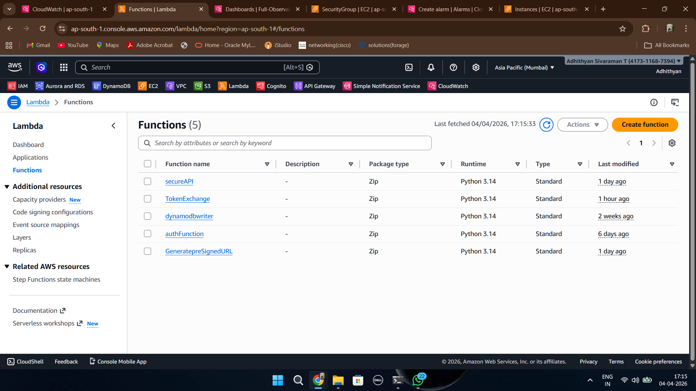

Available Lambda functions were selected for centralized monitoring and error tracking.

---

## Lambda Error Alarm Setup

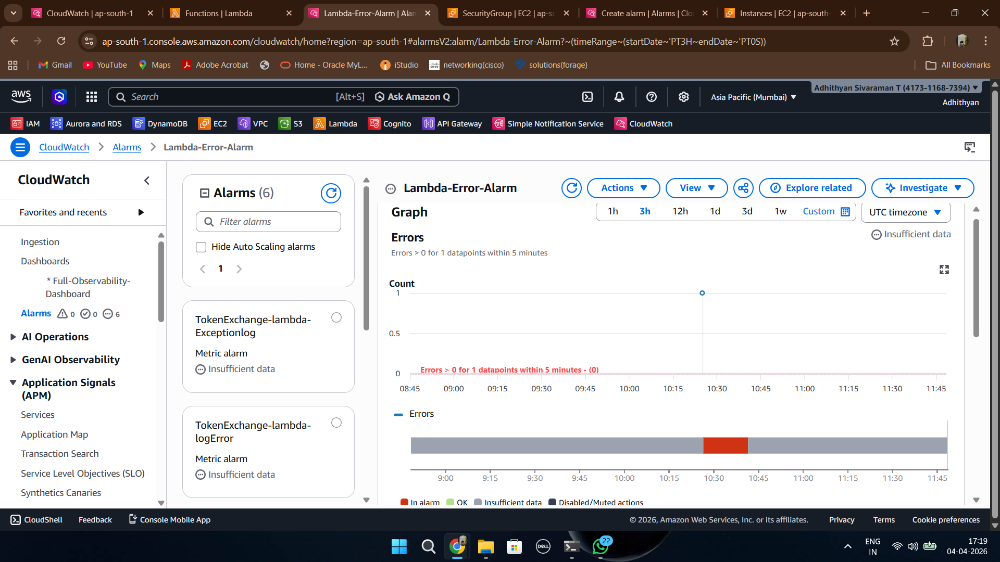

CloudWatch error metrics for Lambda functions were selected and configured.

---

## Lambda Alarm Created

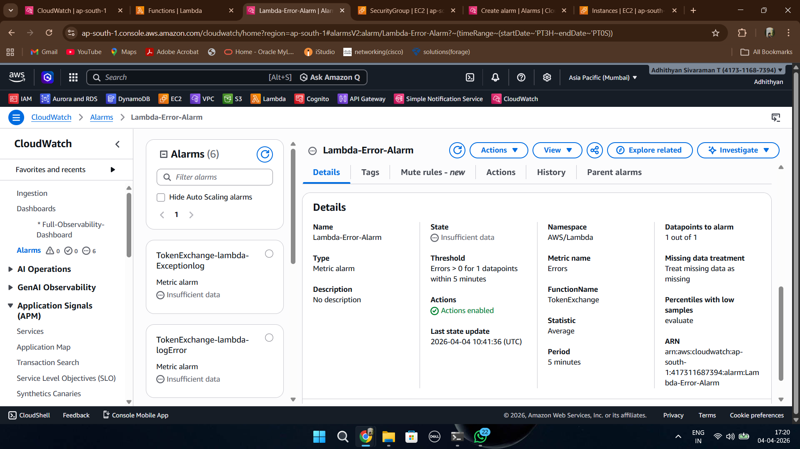

A Lambda alarm was created to detect function failures and execution issues.

---

## API Gateway Metrics Selection

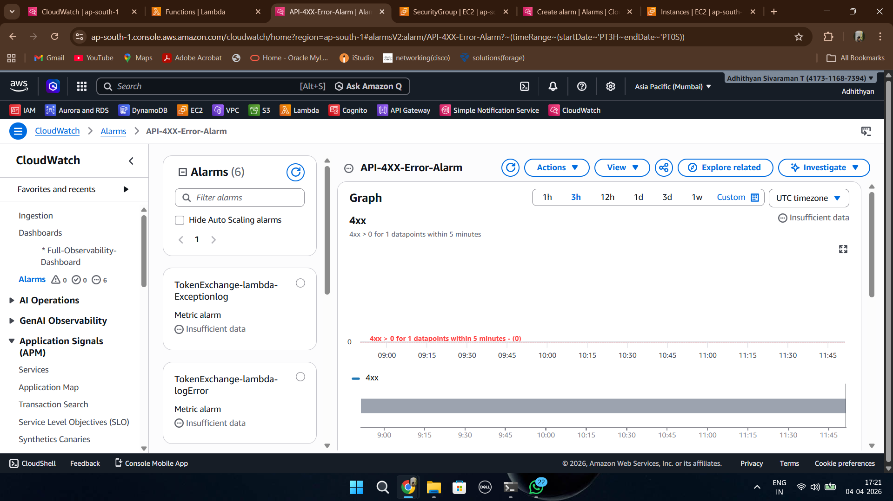

API Gateway metrics were selected to monitor request failures and API health.

---

## API Alarm Created

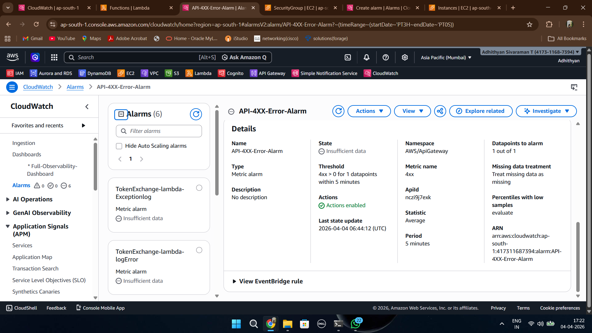

API monitoring alarms were created for tracking API failures.

---

## CloudWatch Log Group

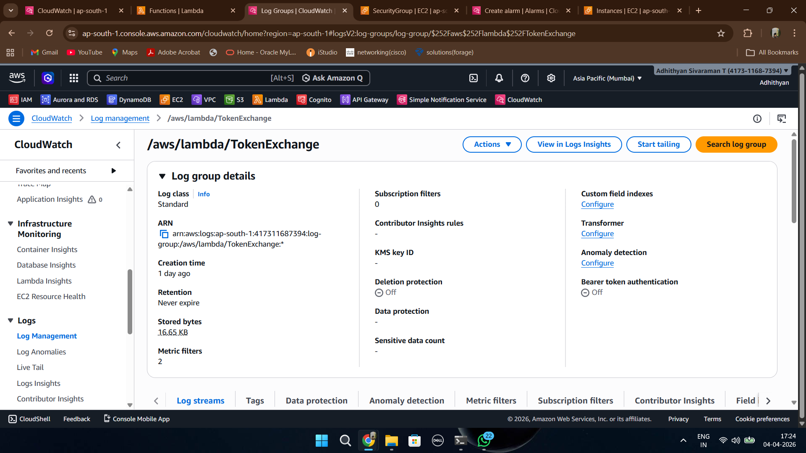

CloudWatch Log Groups were configured to store application-generated logs.

---

## ERROR Metric Filter

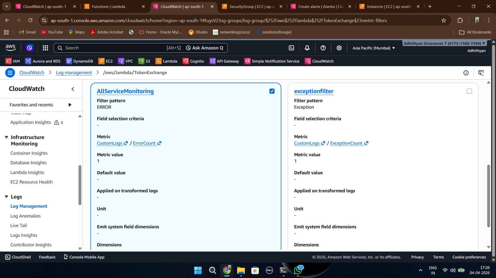

A metric filter was configured to identify ERROR patterns from logs and convert them into CloudWatch metrics.

---

## EXCEPTION Metric Filter

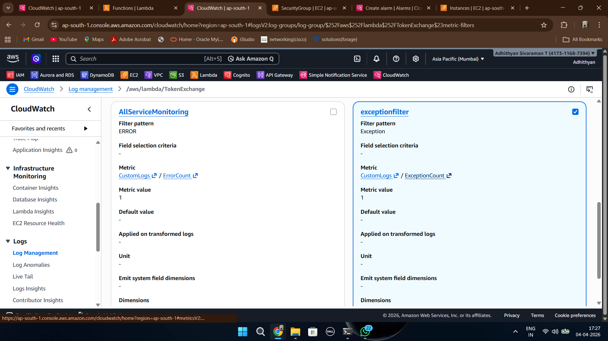

A second metric filter was created to detect Exception patterns generated from application logs.

---

## Custom Metrics Visible

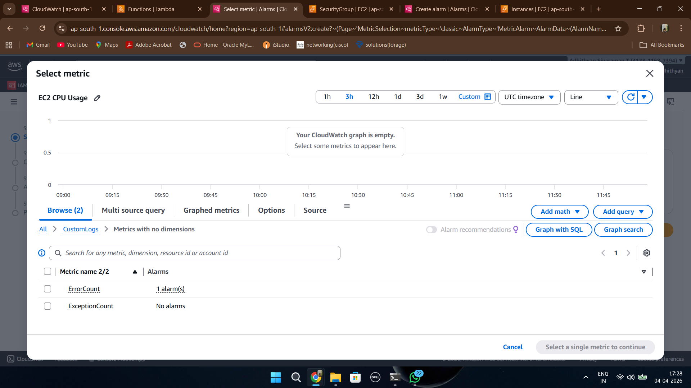

Custom metrics generated from metric filters became available in CloudWatch.

---

## Log Alarms Created

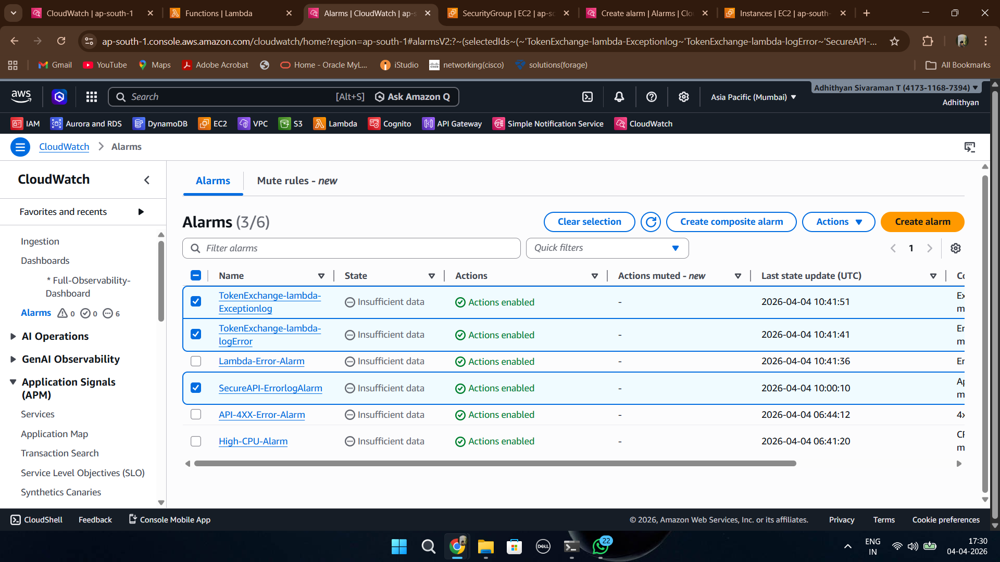

CloudWatch alarms were created using log-derived metrics for automatic failure detection.

---

## Dashboard Created

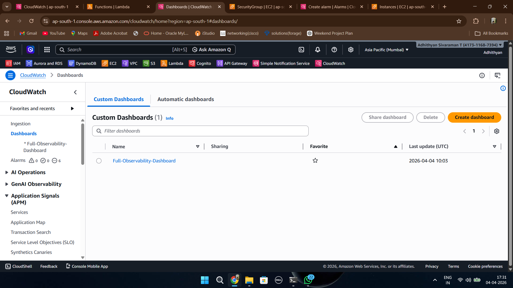

A centralized dashboard named **Full-Observability-Dashboard** was created.

---

## EC2 CPU Widget

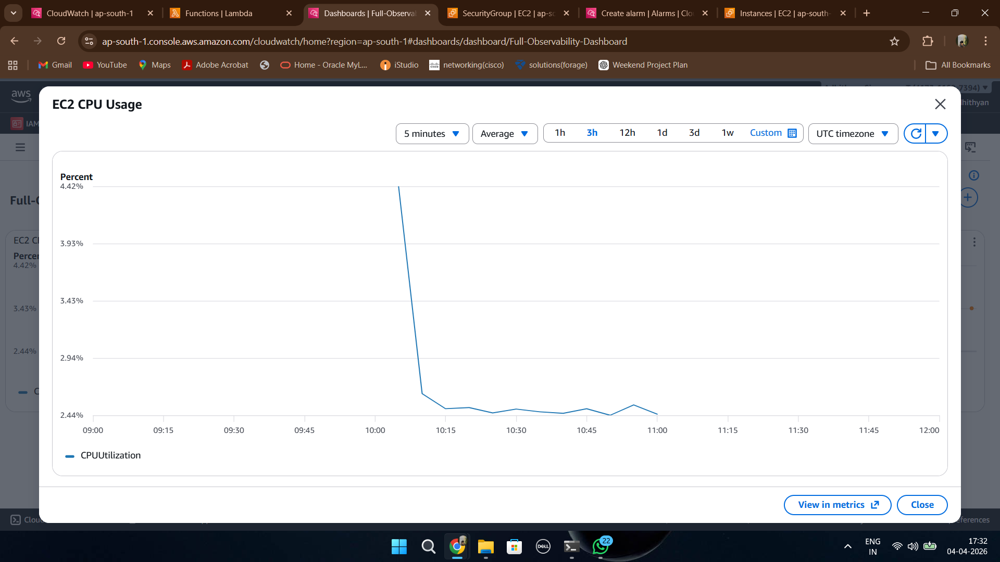

Dashboard widgets were configured to display EC2 CPU utilization trends.

---

## Lambda Monitoring Widget

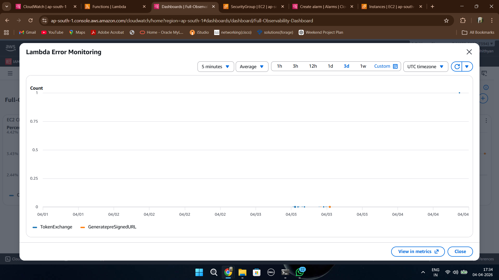

Lambda monitoring widgets provide visibility into function execution and failures.

---

## API Monitoring Widget

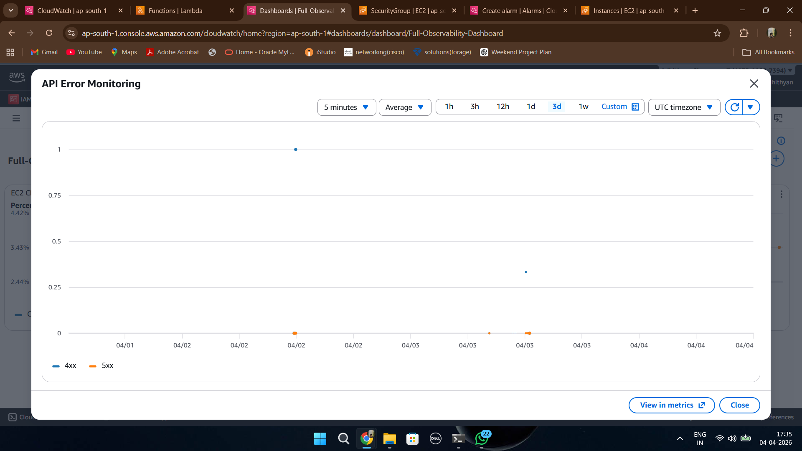

API Gateway widgets display request metrics and API health information.

---

## Log Monitoring Widget

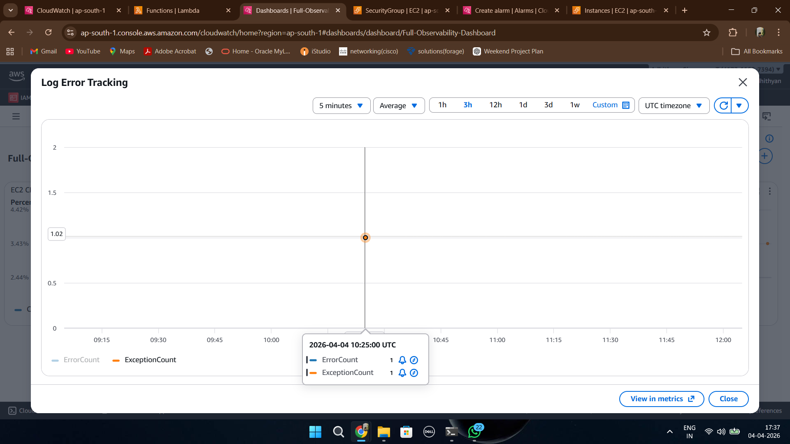

A dedicated widget tracks ErrorCount and ExceptionCount metrics generated through CloudWatch log filters.

---

## Number Widget

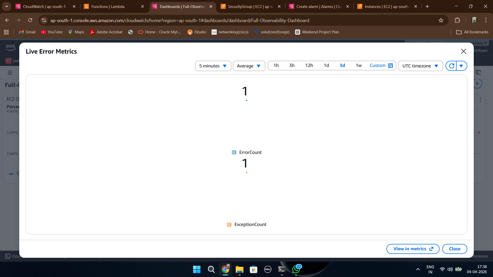

Number widgets provide instant visibility into live application error metrics.

---

## Final Dashboard View

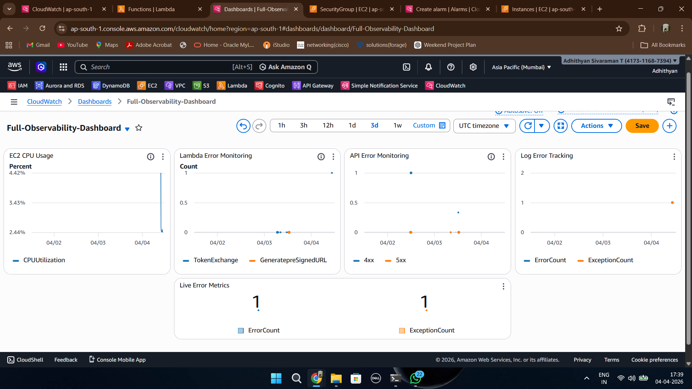

The centralized dashboard combines infrastructure metrics, APIs, Lambda metrics, logs and monitoring widgets into one observability view.

---

## Email Alert Received

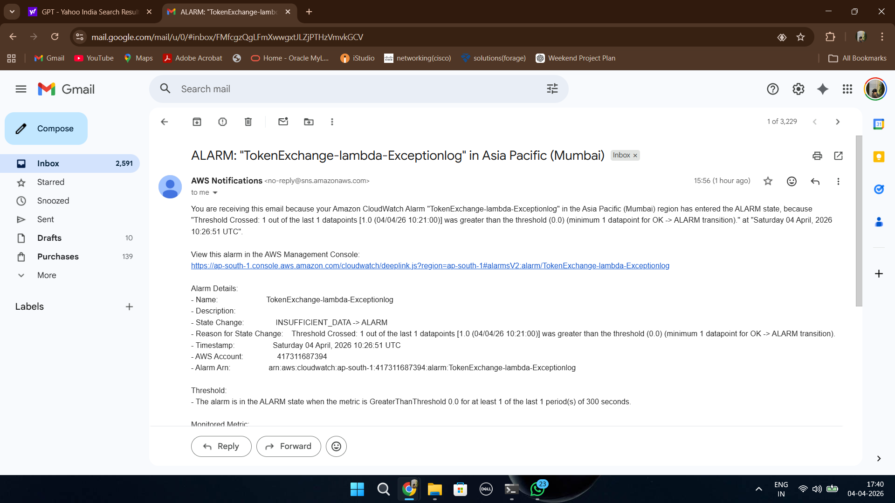

CloudWatch successfully triggered SNS notifications and delivered email alerts after thresholds were exceeded.

Monitoring flow:

CloudWatch Metrics  
↓  
CloudWatch Alarm  
↓  
Amazon SNS  
↓  
Email Notification

---

## Outcome

Successfully implemented a production-style AWS monitoring and observability setup capable of:

- Infrastructure monitoring
- Lambda monitoring
- API monitoring
- Log-based monitoring
- Custom metric creation
- Dashboard visualization
- Real-time alert delivery
