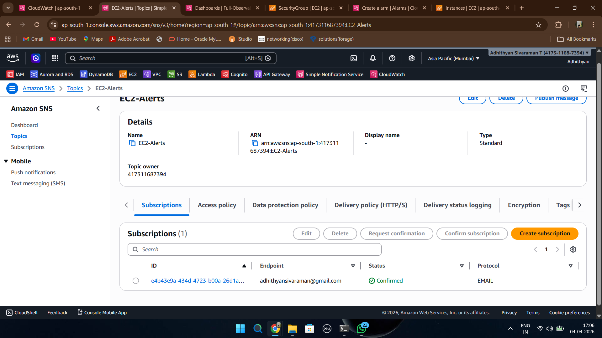
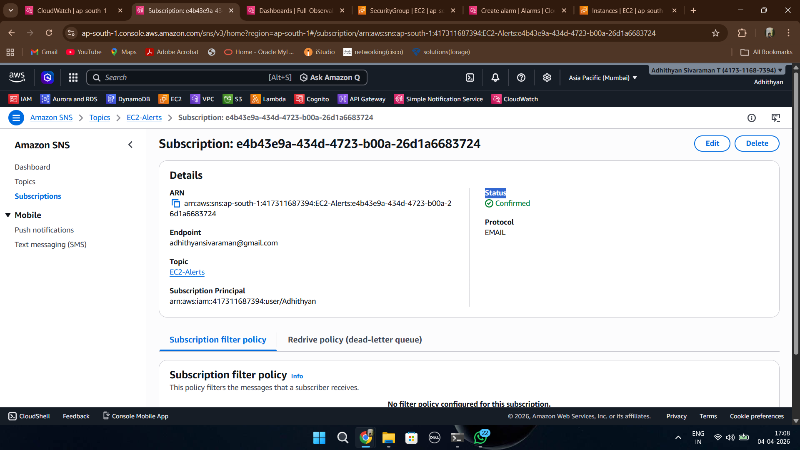
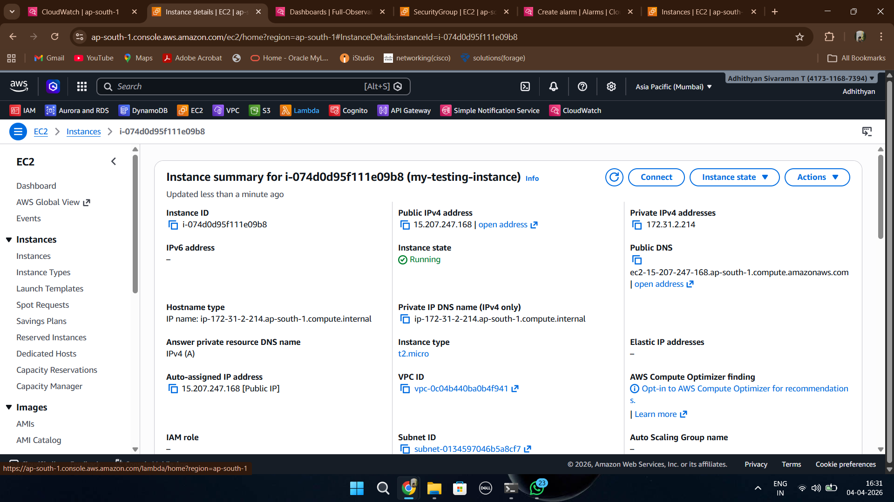
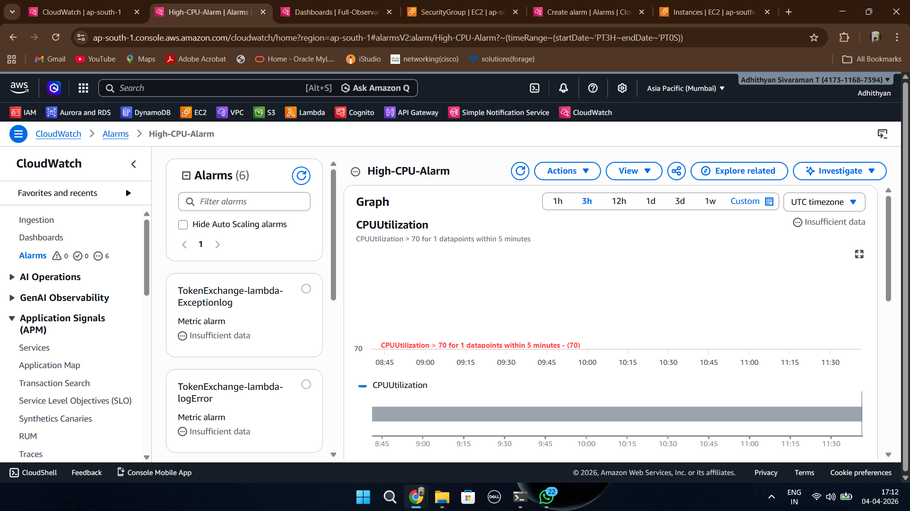
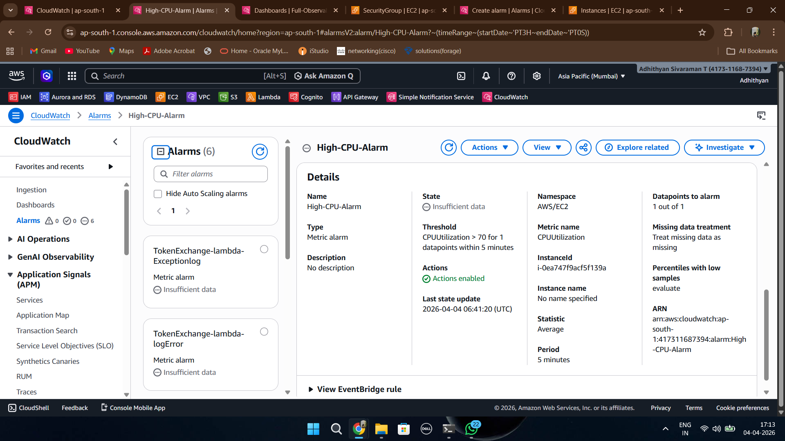

## Amazon SNS Topic Configuration

An Amazon SNS topic named **EC2-Alerts** was created to handle notification delivery for CloudWatch alarms. This topic acts as the communication layer between CloudWatch and subscribed users.

---

## Email Subscription Setup

.png)

An email subscription endpoint was attached to the SNS topic. This enables CloudWatch alarms to deliver notifications directly through email.

---

## Subscription Confirmation

The email subscription request was successfully confirmed.

---

## EC2 Monitoring Configuration

An EC2 instance was selected and used as the infrastructure resource for monitoring CPU metrics.

---

## CPU Alarm Configuration

A CloudWatch alarm was configured for EC2 CPU utilization monitoring.

---

## CPU Alarm Created

The EC2 CPU alarm was successfully created and linked with SNS notifications.
